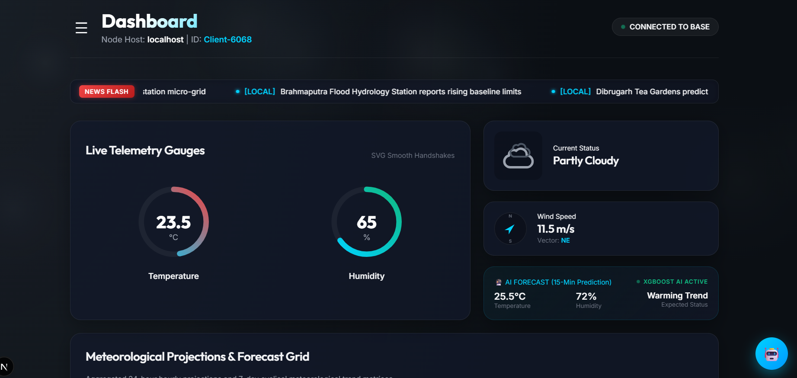
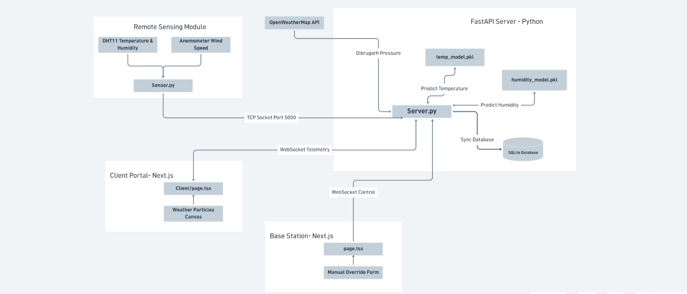
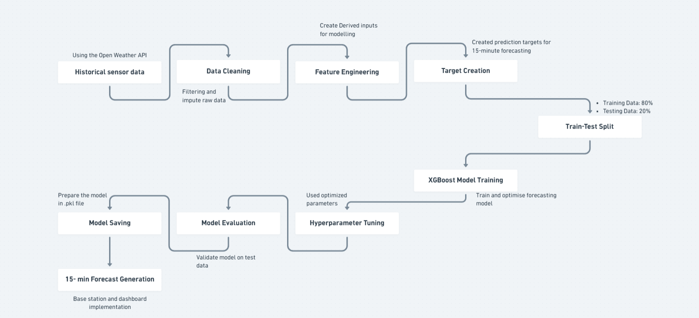
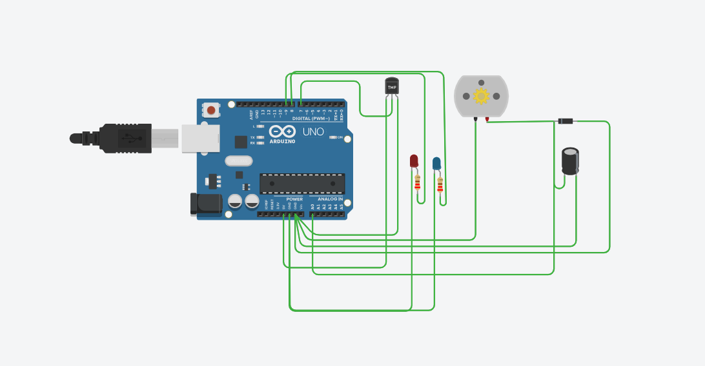
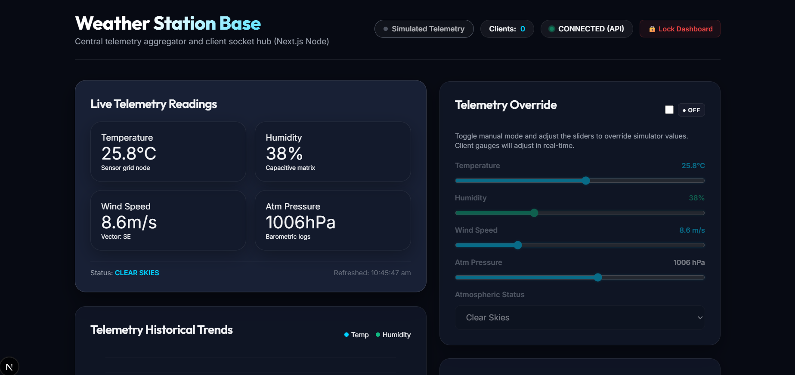

# 🌦️ Intelligent Weather Station and Predictive AI Portal System

<p align="center">
  <a href="https://github.com/Abhijit12322/Weather_Monitoring_System/raw/main/Image/Client.mp4">
    
  </a>
  <br>
  <b>▶️ Click the dashboard screenshot above to download/play the Client Demonstration Video (Client.mp4)</b>
</p>

An IoT-enabled, AI-powered hyperlocal weather monitoring and forecasting platform designed for real-time telemetry acquisition, machine learning-based prediction, emergency advisory broadcasting, and interactive web visualization.

---

## 🚀 Key Features

### 📡 Real-Time Telemetry Acquisition
* **Sensor Core**: Collects atmospheric metrics using a **DHT11** sensor (temperature & humidity) and a **DIY Cup Anemometer** (wind speed).
* **TCP Socket Stream**: Ingests high-frequency sensor telemetry over a custom asynchronous TCP socket server running on **Port 5000**.
* **OpenWeatherMap Integration**: Automatically fetches and logs real-time barometric pressure data to enrich local sensor readings.
* **Low-Latency Broadcasts**: Instantly pushes telemetry updates to all active client portals and administrative command interfaces.

### 🧠 XGBoost Machine Learning Forecasting
* **Hyperlocal Projections**: Utilizes serialized **XGBoost Regression** models to forecast climate conditions.
* **Model Files**:
  * `temp_model.pkl` - Predicts future temperature trends.
  * `humidity_model.pkl` - Forecasts humidity variations.
* **Feature Engineering**: Incorporates lag variables, rolling averages, timestamps, and diurnal cycles (sine/cosine curves reflecting solar temperature fluctuations).
* **Forecast Horizon**: Predicts temperature and humidity changes **15 minutes** into the future.

### 🗄️ Database Logging
* **SQLite Database**: Persisted locally in `weather_station.db`.
* **Database Tables**:
  * `weather_log`: Stores raw sensor readings, pressure indicators, and AI prediction values.
  * `alert_log`: Logs generated weather advisories and safety warnings.
  * `system_event_log`: Audits admin logs, WebSocket connections, and manual overrides.

### 🔄 WebSocket Communication
Dual-channel WebSocket architecture for instantaneous synchronization:
* **`/ws/client` (Client Portal)**: Feeds live readings, predictions, safety alerts, and weather ticker logs to standard clients.
* **`/ws/admin` (Admin Console)**: Handles manual overrides, telemetry slides, and scenario playbooks.

---

## 🏗️ System Architecture

The platform consists of a **Remote Sensing Module**, a **FastAPI backend framework** with an integrated **XGBoost Inference Engine**, and a **Next.js admin/client presentation layer**.

<p align="center">
  
</p>

### Key Architectural Modules:
* **Remote Sensor Node**: Polls DHT11 and Cup Anemometer values, streaming them via raw TCP socket.
* **FastAPI Server**: Ingests sensor data, merges barometric pressure, runs XGBoost predictions, logs entries to SQLite, and broadcasts data.
* **WebSocket Coordinator**: Handles full-duplex messaging between base stations and clients.

---

## 📈 Machine Learning Pipeline

The forecasting pipeline is trained to compute 15-minute climate projections based on structural lag states and diurnal cycles.

<p align="center">
  
</p>

1. **Dataset Ingestion**: Collects historical temperature and humidity logs from SQLite database records.
2. **Feature Engineering**: Develops rolling statistics, temporal features, lag parameters, and diurnal factors.
3. **Train-Test Partition**: Splits historical data into an `80:20` ratio for training and validation.
4. **XGBoost Training**: Trains regression models using targeted gradient boosting configurations.
5. **Model Serialization**: Serializes trained networks into `temp_model.pkl` and `humidity_model.pkl` for rapid local inference.

---

## 🔌 Hardware Design

### Core Components
* **Arduino UNO (U2)**: Main microcontroller managing analog-to-digital signal conversions and frequency calculations.
* **Analog Temp/Weather Sensor (U1)**: A three-pin sensor (providing `+VS`, `VOUT`, and `GND`) that outputs environmental temperature voltage.
* **DIY Cup Anemometer (M1)**: A DC motor configuration acting as an anemometer, capturing wind velocity and generating frequency pulses.
* **Decoupling Capacitor (C1 - 1µF)**: Connected in parallel across the positive and negative terminals of the Anemometer motor to filter high-frequency noise and voltage fluctuations.
* **Clamping Diode (U3)**: Connected in parallel across the Anemometer motor (cathode to signal line, anode to ground) to protect the input pins against inductive back-EMF spikes during rotation.
* **LED Indicators**: 
  * **Red LED (D2)**: Warning state indicator.
  * **Blue LED (D1)**: Telemetry link status indicator.
* **Current-Limiting Resistors (R1, R2 - 220Ω)**: Wired in series with the LEDs to prevent overcurrent.

<p align="center">
  
</p>

### Hardware Connections
| Schematic Component | Arduino Pin | Connection Description |
| :--- | :--- | :--- |
| **Analog Sensor (U1) +VS** | `5V` | 5V Power Supply Line (`U2_5V`) |
| **Analog Sensor (U1) GND** | `GND` | Common Ground Reference (`U2_GND`) |
| **Analog Sensor (U1) VOUT**| `A0` | Analog Input Pin 0 (Temperature Data) |
| **Anemometer Motor (M1) +** | `D3` | Digital Input Pin 3 (Pulse Interrupt Line) |
| **Anemometer Motor (M1) -** | `GND` | Common Ground Reference |
| **Red LED (D2) Anode** | `D7` | Digital Output Pin 7 (via **220Ω Resistor R1**) |
| **Blue LED (D1) Anode** | `D9` | Digital Output Pin 9 (via **220Ω Resistor R2**) |
| **LED Cathodes (D1, D2)** | `GND` | Common Ground Reference |
| **Capacitor (C1)** | Across `M1` | Parallel noise filter across positive/negative motor leads |
| **Diode (U3)** | Across `M1` | Parallel flyback protection (Cathode to `D3`, Anode to `GND`) |


<p align="center">
  
</p>
---


## 🖥️ Base Station Dashboard (Admin Console)

Provides administrative command and control utilities:
* **Real-time Telemetry Grid**: Displays active environmental status and statistics.
* **Manual Override Controls**: Sliders to override sensor values directly (Temp, Humidity, Wind Speed, Pressure).
* **Presets Broadcaster**: Instant dispatch buttons for storms, heatwaves, floods, or clearing alerts.
* **Scenario Playlist Manager**: Automatically plays back transition playlists (e.g., Monsoon Arrival) to simulate dynamic changes.

<p align="center">
  
</p>

---

## 🌐 Client Portal & Emergency Alerts

Real-time presentation console for public safety:
* **Client Presentation dials**: Renders speedometers, temperature scales, and trend charts.
* **Emergency Alert System**: 
  * `info`: Blue banners for minor local warnings or advisories.
  * `warning`: Orange banners for potential hazards like high heat indexes.
  * `danger`: Flashing red fullscreen warning screens for critical conditions (like severe storms and tornadoes), accompanied by alarms.
* **AI Companion Chatbot**: Direct access to an LLM companion, responding to weather inquiries based on local sensor records.

<p align="center">
  
</p>


---

## 🗃️ Database Schema

### Table: `weather_log`
```sql
CREATE TABLE weather_log (
    id INTEGER PRIMARY KEY AUTOINCREMENT,
    timestamp REAL NOT NULL,
    temperature REAL NOT NULL,
    humidity INTEGER NOT NULL,
    pressure INTEGER,
    wind_speed REAL,
    wind_dir TEXT,
    status TEXT,
    predict_temp REAL,
    predict_humidity INTEGER
);
```

### Table: `alert_log`
```sql
CREATE TABLE alert_log (
    id INTEGER PRIMARY KEY AUTOINCREMENT,
    timestamp REAL NOT NULL,
    title TEXT NOT NULL,
    message TEXT NOT NULL,
    severity TEXT NOT NULL
);
```

### Table: `system_event_log`
```sql
CREATE TABLE system_event_log (
    id INTEGER PRIMARY KEY AUTOINCREMENT,
    timestamp REAL NOT NULL,
    event_type TEXT NOT NULL,
    message TEXT NOT NULL
);
```

---

## 🛠️ Technology Stack

* **Backend**: FastAPI, Uvicorn, Python 3, SQLite3, Joblib, Scikit-learn, XGBoost.
* **Frontend**: Next.js 16 (App Router), React 19, TypeScript, Vanilla CSS (HSL premium UI framework, glassmorphism cards).
* **Hardware**: Arduino UNO, DHT11, DIY Anemometer, 16x2 LCD.

---

## ⚙️ Installation & Running

### 1. Set Up the Backend Server
Create a virtual environment and install the required dependencies:
```bash
# Create and activate virtual environment
python -m venv venv
# On Windows:
.\venv\Scripts\activate
# On macOS/Linux:
source venv/bin/activate

# Install dependencies
pip install -r requirements.txt

# Start the FastAPI Server
python server.py
```
* **API Portal**: `http://localhost:8000`
* **TCP Socket Listener**: `Port 5000`

### 2. Set Up the Next.js Frontend
Install packages and run the Next.js dev server:
```bash
cd frontend
npm install
npm run dev
```
* **Admin Dashboard**: `http://localhost:3000` (Access PIN: **`8822`**)
* **Client Portal**: `http://localhost:3000/client`

### 3. Stream Mock Sensor Data (Optional)
Run the remote sensor simulator script to feed mock readings to the base station:
```bash
python sensor.py
```

---

## 🔮 Future Scope
* **Extended Forecasting**: Integrating RNN models (LSTM/GRU) for 24h-48h weather projections.
* **Mesh Network**: Deploying multi-sensor networks reporting to a single base station.
* **Mobile Portals**: Developing native iOS and Android apps with push alerts.

---

## 📄 License
Academic and Research Use Only.

---

## Author
Developed as part of the Intelligent Weather Station and Predictive AI Portal research project.
